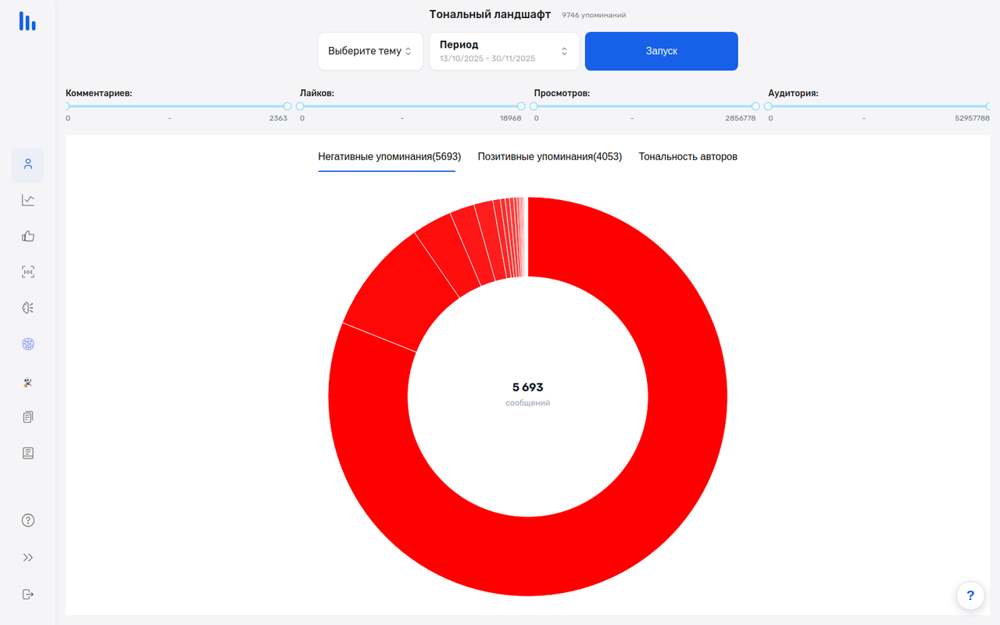
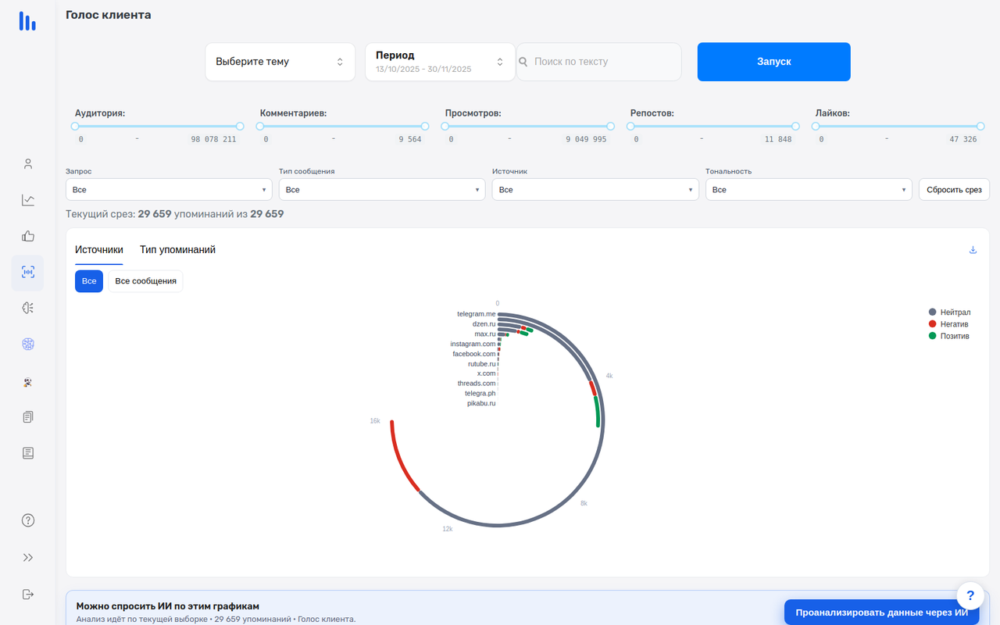
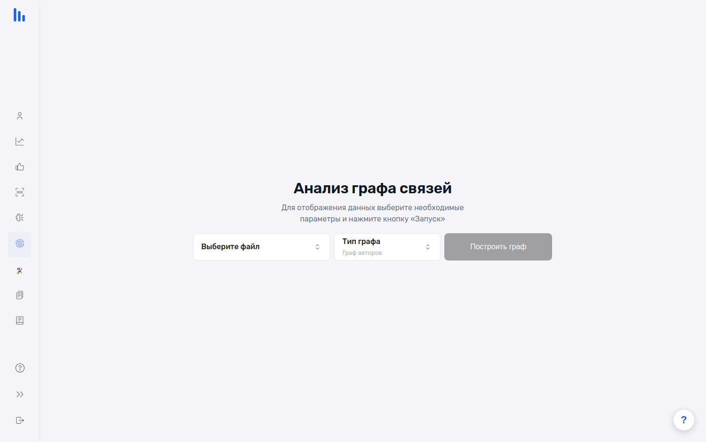
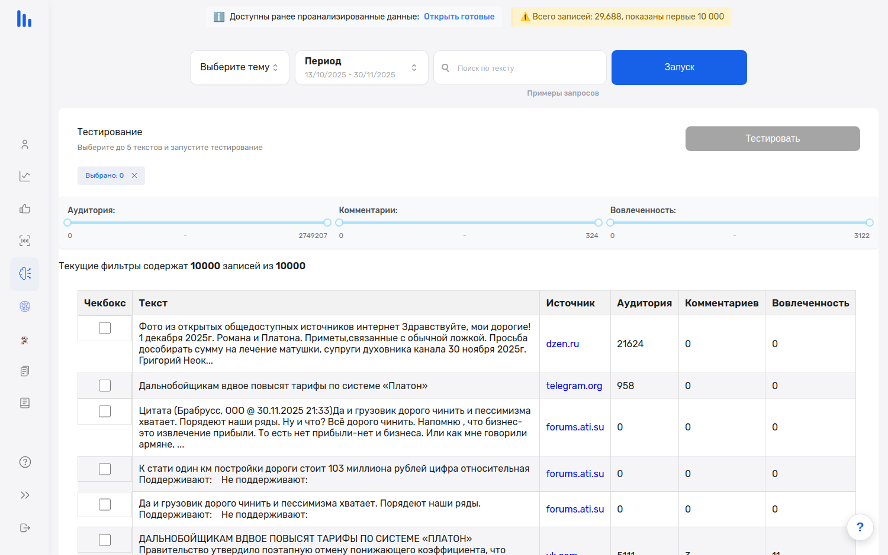

# Tellscope Backend

Аналитическое приложение для анализа данных **социальных медиа и СМИ**.

Пользователь загружает набор данных — тексты публикаций с метаданными (например, выгрузки из систем мониторинга СМИ/соцсетей) — а сервис индексирует его и строит аналитические разрезы: тональность, распространение информации, рейтинг СМИ, структуру «голоса клиента», тематики. Часть аналитики выполняет большая языковая модель, развёрнутая локально.

## Возможности

- **Загрузка и обработка наборов данных** — папки-темы пользователя, файлы с текстами и метаданными; индексация в Elasticsearch и векторная база Qdrant (эмбеддинги); асинхронные задачи с прогрессом.
- **Аналитические разделы** — тональный ландшафт (негатив/позитив по авторам и источникам), информационный граф (как распространяется информация), медиа-рейтинг, голос клиента, сравнение тем/конкурентов, связи авторов.
- **ИИ-анализ** — вопросы к корпусу на естественном языке, пакетный прогон LLM по текстам, кластеризация на тематики, ИИ-бот поверх загруженных данных (RAG), smart-agent с генерацией итоговых отчётов.
- **Мосинформ.Рейтинг** — дополнительный контур, подключается отдельным роутером: выгрузки Медиалогии превращаются в Excel-свод и презентацию PPTX с рейтингом медиаприсутствия ОИВ Москвы.
- **Служебное** — журнал и очередь ML-задач на GPU, статусы/прогресс вычислений, мониторинг (Prometheus/Grafana), LLM-гейтвей с метриками.

## Архитектура

- **Backend**: Python + FastAPI (основной код — в `main.py`), модули: `auth` (пользователи, JWT), `load_data_elastic` (приём и индексация файлов), `embedding_model_manager`, `mlops` (LLM-гейтвей, очередь задач), Celery-воркеры.
- **LLM**: локальный vLLM (OpenAI-совместимый API, по умолчанию `Qwen3-32B-FP8`).
- **Хранилища**: PostgreSQL (пользователи), Elasticsearch (полнотекстовый поиск), Qdrant (векторы), Redis (состояния задач, прогресс, очередь), файловая система (загруженные датасеты).
- **Frontend** (отдельный репозиторий): React + Redux.

## Запуск

Требуются сервисы: PostgreSQL, Elasticsearch, Redis, Qdrant и (для LLM) vLLM. Переменные окружения — в `.env`/`config.py` (доступ к БД и сервисам).

```bash
pip install -r requirements.txt
uvicorn main:app --host 0.0.0.0 --port 5000
```

Фоновые задачи:

```bash
celery -A celery_app worker --loglevel=info --pool=solo --concurrency=1
```

Деплой на сервере выполняется через supervisor (программа `fastapi_app`), фронтенд собирается и раздаётся nginx.


## Скриншоты и демо

Анимированное демо: тональный ландшафт (удаление и возврат источника кликом), график «Тональность авторов», вкладки связей авторов и ИИ-анализа:


| Тональный ландшафт | Информационный граф | Голос клиента |
|---|---|---|
|  |  |  |

| Связи авторов | ИИ-анализ |
|---|---|
|  |  |